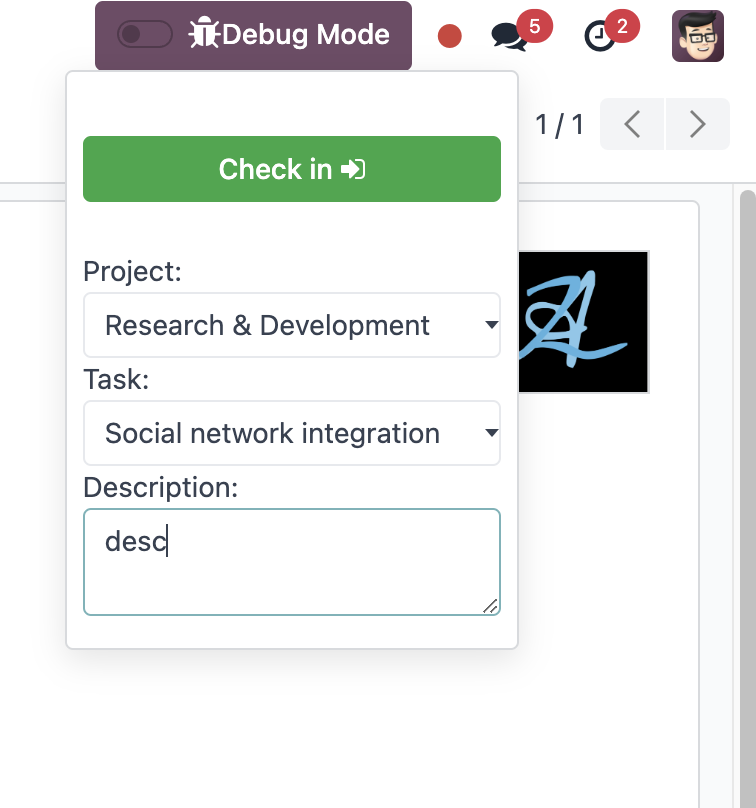

# AZ Project Attendance

The AZ Project Attendance is a module that extends the functionality of the hr_attendance and project modules in Odoo.
It allows users/employees to record their attendance with additional information such as the project, task, and
description.

# ONLINE AVAILABLE : <a href="http://annzzu.duckdns.org/">Odoo Apps</a>

http://annzzu.duckdns.org/

### Credentials:

- User: admin
- Password: admin

## Table of Contents

- [Features](#features)
- [Usage](#usage)
-
    - [Kiosk Mode](#kiosk-mode)
-
    - [Systray](#systray)
-
    - [Form View](#form-view)
- [Support](#support)

## Features

- Allows users to record attendance with additional information: project, task, and description.
- Integrates with the hr_attendance and project modules.
- Works in various modes: form view, systray, and kiosk.

## Usage

### Kiosk Mode

<a href="https://youtu.be/8-F3J98MyzY">Pin attendance video</a>
<a href="https://youtu.be/kuhCqAieNDY">Barcode attendance video</a>

In the kiosk mode, users can record their attendance along with the project, task, and description from a public
terminal.

#### Kiosk Mode Workflow

1. **Attendance Additional Information Form Page:** A new page, `project_attendance`, has been added to capture
   additional attendance information.

2. **Barcode Scanning:** Upon scanning a barcode, the user is redirected to the `project_attendance` page.

3. **Employee Selection:** If an employee is manually selected, the system redirects to the `project_attendance` page.

4. **Pin Code Validation:** If the company has enabled pin code validation, successful validation will redirect the user
   to the `project_attendance` page.

5. **Check In/Out on Project Attendance Page:** The `project_attendance` page features a check in/out button along with
   a form to capture additional information.

6. **Attendance Record Creation:** After the user confirms check in/out, an attendance record is created with the
   additional information provided.

7. **Greeting Page Redirection:** Post check in/out, the system redirects to a greeting page displaying the user's name
   and their most recent attendance record.

### Systray

<a href="https://youtu.be/8-F3J98MyzY">Attendance systray</a>

In the systray mode, users can quickly record their attendance along with the project, task, and description without
having to navigate to a separate page.

### Systray Mode Workflow

1. **Project/Task/Description Input:** The systray attendance check-in/check-out now includes the ability to input project, task, and description information.

2. **Ongoing Attendance Update:** During the check-in/check-out process, the ongoing attendance record is updated accordingly.

### Form View

In the form view, users can record their attendance along with the project, task, and description.

## Support

For any issues or queries, please contact the author at anaz.zurabashvili@gmail.com

